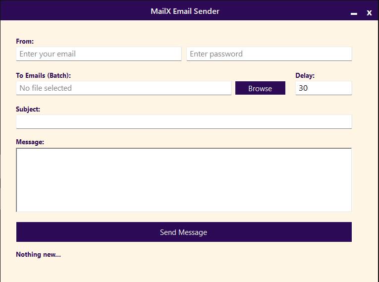

# MailX - Bulk Email Sender

[](https://github.com/oTnarP/MailX/issues) [](https://github.com/oTnarP/MailX/network) [](https://github.com/oTnarP/MailX/stargazers)

MailX is a lightweight Windows Forms application built in C# for sending bulk emails using a custom SMTP server. Whether you’re sending newsletters, alerts, or notifications, MailX offers a no-nonsense solution with a clean interface and essential features.

## Table of Contents
- [Overview](#overview)
- [Features](#features)
- [Getting Started](#getting-started)
- [Usage](#usage)
- [Screenshots](#screenshots)
- [Customization](#customization)
- [Contributing](#contributing)
- [License](#license)
- [Contact](#contact)

## Overview

MailX enables you to send personalized bulk emails with ease. It reads SMTP settings from a configuration file, imports recipient email addresses from a text file, and sends messages sequentially with a user-defined delay to avoid server rate limits. It’s perfect for anyone who needs a straightforward tool without the clutter.

## Features

- **Custom SMTP Configuration:** Automatically reads your SMTP host and port from a `Host.txt` file in your Documents folder.
- **Bulk Email Sending:** Import a text file containing email addresses and send out emails one by one.
- **Adjustable Delay:** Set the delay (in seconds) between each email to keep within SMTP server limits.
- **Real-Time Logging:** View live status updates as emails are sent.
- **User-Friendly Interface:** Enjoy a minimalistic and intuitive WinForms design.
- **Drag-and-Drop Window:** Easily reposition the application window by dragging the designated area.

## Getting Started

### Prerequisites
- **Visual Studio:** Required for building and running the project.
- **.NET Framework:** The application is built using the .NET Framework (compatible with WinForms).

### Installation

1. **Clone the Repository:**
   ```
   git clone https://github.com/oTnarP/MailX.git
   ```

2. **Open in Visual Studio:**
   Open the solution file (`MailX.sln`) in Visual Studio.

3. **Build the Project:**
   Build the solution to compile the application.

4. **Configure SMTP Settings:**
   - Go to your Documents folder.
   - Locate (or let the app create) the `Host.txt` file.
   - Edit it to include your SMTP details in this format:
     ```
     smtp.example.com:587
     ```

## Usage

1. **Launch the Application:**
   Run MailX from Visual Studio or as a standalone executable.

2. **Enter Your Credentials:**
   Input your email address and password to authenticate with your SMTP server.

3. **Import Email List:**
   Click the **Browse** button and select a text file containing one email address per line.

4. **Compose Your Email:**
   Fill in the subject and body fields with your message content.

5. **Set the Delay:**
   Specify how many seconds to wait between sending each email.

6. **Send Emails:**
   Click the **Send** button to start the bulk email process. The log will update with the status of each sent email.

## Screenshots

```

```

## Customization

- **SMTP Settings:**  
  Change your SMTP server details by editing the `Host.txt` file located in your Documents folder.

- **UI Tweaks:**  
  Since MailX is built with WinForms, you can open the project in Visual Studio to modify the user interface using the designer.

- **Email Delay:**  
  Adjust the delay between emails by changing the value in the delay textbox to suit your needs.

## Contributing

Contributions are welcome! If you have ideas, bug fixes, or improvements, please open an issue or submit a pull request. Your input is appreciated and helps make MailX even better.

## License

This project has **no license** and is **free to use for everyone**.

## Contact

If you have any questions or suggestions, feel free to reach out:
- **Email:** cto@unicodeit.com
- **GitHub:** [oTnarP](https://github.com/oTnarP)

---

Enjoy using MailX and happy emailing!
